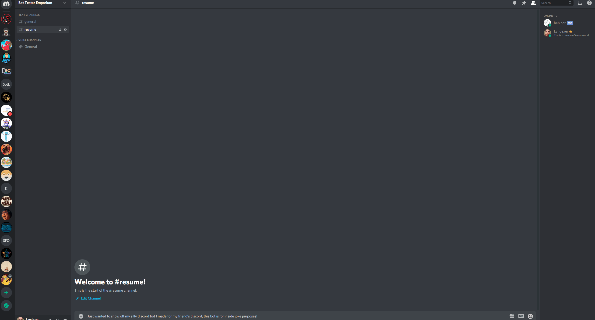

## HEH-BOT
A silly idea a friend of mine pitched for our personal discord and friend group. 
Heh-bot is a bot who will count how many times a user says heh in chat. Along with counting
the phrase the bot allows you to look up your own score and other user's scores to see what your
degeneracy level is at.  
  
The bot also has additional easter eggs set to go off randomly when certain criteria are met.

## Tech/framework used
Discor.js  
Javascript  

## Demo

